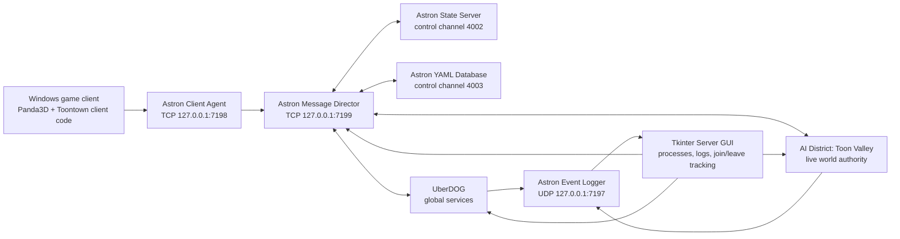

# Open Town Local: architecture and file layout

This guide maps the Windows bundle, its startup flow, networking, persistent
data, source packages, runtime, resources, logs, and local modifications.

Open Town is the user-facing name for this locally modified upstream Open
Toontown development stack. It is not a Corporate Clash codebase. Target-aware
`darwin\` and `linux\` scripts and launcher build sources are present. The
published source contains no native runtime; the current local development
environment has working Windows and Apple Silicon stacks, while Linux remains
unbuilt.

## 1. The shortest useful mental model

```text
Windows launchers
├─ Server GUI
│  ├─ Astron: routing + client gateway + state + YAML database + event log
│  ├─ UberDOG: global/persistent services
│  └─ AI District: authoritative live world simulation
└─ Game client
   └─ Rendering, input, UI, client-side distributed objects
```



Channels `4002` and `4003` are Astron message channels. They are not Windows
TCP ports.

## 2. Bundle root

```text
Open-Toontown-Local\
├─ 1 - Open Town Server GUI.bat
├─ 2 - Open Town Client.bat
├─ Open Town Launcher.bat
├─ Open Town Launcher.command
├─ open-town-launcher.sh
├─ Build Windows Launcher.bat
├─ BUILDING.md
├─ CUSTOM_FEATURES.md
├─ Test Server Lifecycle.bat
├─ README_LOCAL.md
├─ VERIFICATION.md
├─ ARCHITECTURE_LAYOUT.md
├─ FULL_FILE_INDEX.txt
├─ game\
├─ launcher\
└─ runtime\
   └─ Panda3D-1.11.0-x64\
```

| Path | Responsibility |
|---|---|
| `1 - Open Town Server GUI.bat` | User-facing server shortcut. Delegates to `game\win32\start_server_gui.bat`. |
| `2 - Open Town Client.bat` | User-facing direct-client shortcut. Delegates to `game\win32\start_game.bat`. |
| `Open Town Launcher.bat` | Starts the compiled Windows launcher, with a source fallback. |
| `Open Town Launcher.command` | macOS launcher entry; requires a target-native custom game runtime. |
| `open-town-launcher.sh` | Linux launcher entry; requires target-native custom game/runtime dependencies. |
| `Build Windows Launcher.bat` | Rebuilds the small Windows launcher executable. |
| `BUILDING.md` | Launcher builds and target-native runtime requirements. |
| `CUSTOM_FEATURES.md` | Branding, XP, skip-button, display, and launcher modifications. |
| `Test Server Lifecycle.bat` | Starts Astron → UberDOG → AI, verifies readiness/PIDs/ports, then stops in reverse order. |
| `README_LOCAL.md` | Normal operating instructions, provenance, security, and licensing notes. |
| `VERIFICATION.md` | Evidence from the automated and interactive tests. |
| `ARCHITECTURE_LAYOUT.md` | This human-readable architecture map. |
| `FULL_FILE_INDEX.txt` | Generated relative-path index of every non-Git file in the bundle. |
| `game\` | Open Toontown source, Astron, configuration, resources, logs, and persistent game data. |
| `launcher\` | Portable launcher source, native build scripts, build support, and the final Windows executable. |
| `runtime\` | Custom 64-bit Panda3D/Python 3.9 runtime containing the required OTP and Toontown native extensions. |

## 3. Exact startup flow

### Server flow

```text
1 - Open Town Server GUI.bat
  → game\win32\start_server_gui.bat
    → game\tools\server_gui.py
      → game\astron\win32\astrond.exe
      → python -m toontown.uberdog.UDStart
      → python -m toontown.ai.AIStart
```

Start order:

1. Astron
2. UberDOG
3. AI District

Stop order:

1. AI District
2. UberDOG
3. Astron

The GUI waits for Astron's message-director port, UberDOG's explicit
`UberDOG server is ready.` record, and AI's explicit
`ToontownAIRepository: Done.` record.

### Client flow

```text
Open Town Launcher.bat
  → launcher\dist\windows\OpenTownLauncher.exe
    → validates the adjacent custom runtime
    → python -m toontown.launcher.QuickStartLauncher

2 - Open Town Client.bat
  → game\win32\start_game.bat
    → python -m toontown.launcher.QuickStartLauncher
      → toontown\launcher\QuickLauncher.py
        → toontown\toonbase\ToontownStart.py
          → toontown\toonbase\ToonBase.py
          → toontown\distributed\ToontownClientRepository.py
            → TCP 127.0.0.1:7198
```

The final compiled launcher is 8,452,371 bytes. Its SHA-256 is
`E8123D351F79D02358755C44F1118617ABBFEEDDB3641C229A8F51BA5B553931`.
It packages the launcher UI only, not the game/runtime/resources.

The Windows client launch path sets:

```text
LOGIN_TOKEN=dev
GAME_SERVER=127.0.0.1
```

The login path is:

```text
QuickLauncher
  → OTPClientRepository
  → LoginAstronAccount
  → AstronLoginManager
  → AstronLoginManagerUD
  → accounts.json
  → Astron YAML account/avatar objects
```

After avatar selection, `ToontownClientRepository` hands world-state control to
`toontown\distributed\PlayGame.py`, `HoodMgr.py`, and the relevant hood/town
loaders.

## 4. Server processes and networking

| Component | Entry point | Primary responsibility |
|---|---|---|
| Astron | `astron\win32\astrond.exe` | Message routing, client gateway, state server, YAML object database, and structured event logging. |
| UberDOG | `toontown\uberdog\UDStart.py` | Long-lived/global services that are not tied to one district, including login-supporting, delivery, party, whitelist, news, and related distributed services. |
| AI District | `toontown\ai\AIStart.py` | Authoritative Toon Valley simulation: zones, Cogs, buildings, battles, NPCs, quests, activities, managers, holidays, and district state. |
| Client | `toontown\launcher\QuickStartLauncher.py` | Rendering, input, UI, avatar presentation, and client-side network objects. |
| Server GUI | `tools\server_gui.py` | Starts/stops/restarts the server processes, verifies safety/readiness, merges output, and follows player events. |

| Address/channel | Type | Owner/use |
|---|---|---|
| `127.0.0.1:7197` | UDP | Astron event logger; AI and UberDOG send structured events here. |
| `127.0.0.1:7198` | TCP | Astron client agent; the Windows game client connects here. |
| `127.0.0.1:7199` | TCP | Astron message director; AI and UberDOG connect here. |
| `4002` | Astron channel | State Server control channel. |
| `4003` | Astron channel | Database control channel. |
| `1000000` | Astron channel range base | UberDOG process base channel. |
| `401000000` | Astron channel range base | AI process base; Toon Valley district is currently `401000001`. |

All Windows network binds are loopback-only. `tools\server_gui.py` also refuses
to start a second Astron instance if ports 7197–7199 are already occupied.

## 5. Server GUI internals

### Files

| Path | Responsibility |
|---|---|
| `game\win32\start_server_gui.bat` | Finds Python/Tkinter, falls back to the bundled runtime, and forwards `--self-test`/`--timeout`. |
| `game\tools\server_gui.py` | Tkinter application and non-GUI lifecycle test. |
| `game\tools\SERVER_GUI.md` | Detailed controller usage and safety notes. |

### Main sections inside `server_gui.py`

| Code section | Responsibility |
|---|---|
| `resolve_ppython()` | Resolves `PPYTHON_PATH`, environment override, or the sibling bundled runtime. |
| `validate_loopback_binds()` | Parses `astrond.yml` and refuses non-loopback ports. |
| `build_process_command()` | Builds fixed argument lists and working directories without `shell=True`. |
| `AstronEventLogTailer` | Follows newly appended JSON records in `astron\logs\events-*.log`. |
| `ServerControlApp` | Creates the GUI, process rows, buttons, log display, player counter, and event loop. |
| `_start_sequence()` | Starts Astron → UberDOG → AI and waits for explicit readiness. |
| `_stop_sequence()` | Stops AI → UberDOG → Astron. |
| `start_all()`, `stop_all()`, `restart_all()` | Full-stack controls. |
| `start_component()`, `stop_component()`, `restart_component()` | Dependency-aware per-service controls. |
| `_handle_astron_player_event()` | Tracks `avatarEnter` IDs and accepts `avatarExit` only for a previously tracked player, filtering NPC exits. |
| `_save_log()` | Saves the visible merged log to a user-selected UTF-8 file. |
| `run_lifecycle_self_test()` | Non-GUI ordered start/readiness/port/PID/cleanup verification. |

UberDOG and AI install a Windows `SIGBREAK` handler in `UDStart.py` and
`AIStart.py`, allowing the GUI's Stop and Restart actions to unwind those Python
processes normally.

## 6. `game\` root

```text
game\
├─ .git\                    Upstream source metadata; not needed at runtime
├─ astron\                  Astron executable/config/database/event logs
├─ config\                  Game-specific JSON configuration
├─ darwin\                  Target-aware macOS scripts; local arm64 stack smoke-tested
├─ data\                    AI-persisted building-state JSON
├─ etc\                     Panda PRC and distributed-class schemas
├─ linux\                   Target-aware Linux scripts; native stack not built/tested here
├─ logs\                    Client session logs
├─ otp\                     Shared online-game platform/framework code
├─ resources\               Models, textures, audio, DNA, fonts, icons
├─ runtime-control\logs\     Historical manual bootstrap logs
├─ tools\                   New server GUI and its documentation
├─ toontown\                Game-specific client/AI/UD implementation
├─ win32\                   Windows launch scripts
├─ errorCode                Last launcher error/status code
├─ LICENSE                  Upstream BSD 3-Clause code license
├─ PPYTHON_PATH             Preferred custom PPython executable
├─ README.md                Upstream setup notes
├─ requirements.txt         Python dependency declaration (`pytz`)
└─ useropt.json             Generated later if in-game options are saved
```

`runtime-control\logs\` contains logs from the earlier manual bootstrap test.
The current GUI keeps its merged log in memory unless **Save Log** is used.

## 7. Windows scripts

| Path | Use |
|---|---|
| `win32\start_game.bat` | Supported client launcher. Finds bundled PPython, forces `dev` and localhost, then launches `QuickStartLauncher`. |
| `win32\start_server_gui.bat` | Supported server controller launcher. |
| `win32\start_astron_server.bat` | Upstream manual Astron-only launcher. |
| `win32\start_uberdog_server.bat` | Upstream manual UberDOG-only launcher. |
| `win32\start_ai_server.bat` | Upstream manual AI-only launcher. It contains an infinite restart loop, so the GUI deliberately does not call it. |

Prefer the top-level numbered launchers. The three individual server scripts
are retained as upstream reference/manual troubleshooting entrypoints.

## 8. Configuration and protocol files

| Path | Responsibility |
|---|---|
| `etc\Configrc.prc` | Panda configuration: display/audio, OpenGL, resource path, server version, login mode, DC files, logging, server-data folder, VSync, and 60 FPS target. |
| `etc\otp.dc` | Generic OTP distributed-object schemas: 35 classes and 13 structures. |
| `etc\toon.dc` | Game-specific distributed-object schemas: 317 classes and 33 structures. |
| `astron\config\astrond.yml` | Astron daemon roles, channels, object ranges, DC inputs, YAML backend, event log output, and localhost binds. |
| `config\spellbook.json` | Enabled magic words and required access. Current entries are `SetPos` and `GetPos` at `MODERATOR`. |
| `PPYTHON_PATH` | Preferred relative path to the sibling bundled Windows PPython runtime. |
| `requirements.txt` | Declares `pytz`, installed into the bundled runtime. |

The `.dc` files are the network contract. A common naming pattern is:

```text
DistributedThing.py       client-side proxy/presentation
DistributedThingAI.py     authoritative district implementation
DistributedThingUD.py     global/persistent UberDOG implementation
ThingGlobals.py           constants shared by roles
ThingBase.py              common non-network behavior
```

## 9. Persistent state and generated files

| Path | Data and backup significance |
|---|---|
| `astron\databases\accounts.json` | Maps local login tokens to Astron account object IDs. Current entry: `dev → 100000000`. |
| `astron\databases\astrondb\info.yaml` | Next database object ID. |
| `astron\databases\astrondb\100000000.yaml` | Current local account object and avatar slots. |
| `astron\databases\astrondb\100000001.yaml` | Current Toon object (`Stinky`) and all saved avatar fields. |
| `data\401000001_*_buildings.json` | Persisted building layouts/state by district and zone. |
| `useropt.json` | Generated in `game\` after saving display/audio/window preferences. |
| `errorCode` | Last launcher status/error code. |

To back up progress, stop the client and click **Stop All**, then copy:

```text
game\astron\databases\
game\data\
game\useropt.json    (if it exists)
```

Do not hand-edit the YAML database while the server is running.

## 10. Logs

| Path | Contents |
|---|---|
| `logs\toontown-*.log` | One client log per launch: graphics initialization, login, state changes, warnings, disconnects, and FPS measurements. |
| `astron\logs\events-*.log` | Structured JSON event stream, including `avatarEnter` and `avatarExit`. |
| `runtime-control\logs\` | Historical stdout/stderr from the first manual boot verification. |
| GUI merged log | Live Astron/UD/AI output in the controller window; persisted only when **Save Log** is used. |

## 11. `otp\`: shared platform layer

`otp\` is the reusable framework below the game-specific code.

| Folder | Python files | Responsibility |
|---|---:|---|
| `ai\` | 11 | Generic AI base, time manager, zone data, barriers, and server utilities. |
| `avatar\` | 17 | Shared avatar/player bases, movement safety, handles, emotes, and nametags. |
| `chat\` | 12 | Typed/filtered chat foundations, whitelist, and garbling. |
| `distributed\` | 29 | Client/internal repositories, generic network objects, accounts, districts, and object IDs. |
| `friends\` | 14 | Generic friendship and guild protocol objects. |
| `launcher\` | 4 | Generic launcher/download abstractions. |
| `level\` | 42 | Reusable entity/level/collision framework and editor infrastructure. |
| `login\` | 19 | Login adapters and Astron login client/AI/UD pieces. |
| `movement\` | 4 | Impulses and movement/vector helpers. |
| `namepanel\` | 4 | Reusable name-entry/checking controls. |
| `otpbase\` | 12 | Engine-level base, globals, localization, neutral display-name transform, timers, rendering, and utilities. |
| `otpgui\` | 3 | Shared dialog widgets and global keyboard-shortcut routing. |
| `settings\` | 2 | `Settings.py`, which reads/writes `useropt.json`. |
| `snapshot\` | 7 | Distributed snapshot dispatcher/renderer services. |
| `speedchat\` | 21 | Generic SpeedChat object/menu/terminal framework. |
| `status\` | 3 | Distributed status database service. |
| `uberdog\` | 12 | Generic long-lived chat/avatar/speedchat services. |
| `web\` | 5 | Distributed settings-manager/web support objects. |

Important shared files:

- `otp\distributed\OTPClientRepository.py`
- `otp\distributed\OTPInternalRepository.py`
- `otp\avatar\DistributedPlayerAI.py`
- `otp\login\AstronLoginManager.py`
- `otp\login\AstronLoginManagerUD.py`
- `otp\login\LoginAstronAccount.py`
- `otp\otpbase\OTPBase.py`
- `otp\settings\Settings.py`
- `otp\otpgui\KeyboardShortcutManager.py`

## 12. `toontown\`: game-specific layer

### Core processes and world framework

| Folder | Python files | Responsibility |
|---|---:|---|
| `launcher\` | 7 | Client launch glue and QuickLauncher. |
| `toonbase\` | 15 | Game bootstrap, globals, localization, resources, display, and frame limiting. |
| `distributed\` | 16 | Client/internal repositories, district objects, top-level world FSM, and hood manager. |
| `ai\` | 41 | AI entrypoint/repository, holidays, news, Welcome Valley, and server event systems. |
| `uberdog\` | 33 | UD entrypoint/repository and long-lived/global services. |
| `hood\` | 63 | Neighborhood state, loaders, AI zone data, and environment props. |
| `town\` | 25 | Streets, town loaders, interiors, and street-battle panels. |
| `safezone\` | 91 | Playgrounds, treasures, trolley/fishing spots, activities, and safe-zone loaders. |
| `building\` | 75 | Doors, elevators, boarding, interiors, ownership, and building planners. |
| `estate\` | 90 | Houses, gardens, banks, closets, phones, mailboxes, furniture, and cannons. |
| `coghq\` | 311 | HQs, factories, mints, law offices, country clubs, bosses, and room specifications. |
| `cogdominium\` | 91 | Cogdominium interiors, boardroom/crane/flying/maze activities, and level entities. |

### Players, enemies, and combat

| Folder | Python files | Responsibility |
|---|---:|---|
| `toon\` | 57 | Player avatar/DNA, LocalToon, inventory, experience, NPC Toons, and Toon UI. |
| `suit\` | 48 | Cog DNA/actors, planners, invasions, goons, and boss-family support. |
| `battle\` | 44 | Authoritative battle calculations, attacks, movies, rewards, and effects. |
| `char\` | 4 | Generic game-character and character-DNA classes. |
| `classicchars\` | 43 | Original named walkaround characters and AI counterparts. |

### Activities and progression

| Folder | Python files | Responsibility |
|---|---:|---|
| `makeatoon\` | 12 | Toon creation, body/clothes/color/name shops. |
| `quest\` | 12 | Quest definitions/parser, AI manager, posters, and map UI. |
| `catalog\` | 36 | Catalog item types, generation, UI, ordering, and AI manager. |
| `minigame\` | 131 | Trolley minigames and their client/AI pairs. |
| `fishing\` | 27 | Fish data, ponds, targets, tanks, selling, and bingo. |
| `golf\` | 14 | Course/hole physics, scoring, and AI manager. |
| `racing\` | 35 | Vehicles, tracks, race pads, projectiles, leaderboard, and AI manager. |
| `parties\` | 96 | Party creation/editor/calendar and distributed activities. |
| `pets\` | 36 | Pet DNA, behavior, moods, tricks, UI, and AI manager. |
| `trolley\` | 2 | Trolley client interaction. |
| `tutorial\` | 8 | Tutorial battle, suit planner, and tutorial manager. |

### UI, social, effects, and services

| Folder | Python files | Responsibility |
|---|---:|---|
| `chat\` | 10 | Game chat manager, input modes, whitelist, and resistance phrases. |
| `speedchat\` | 32 | Game-specific SpeedChat menus and decoders. |
| `friends\` | 10 | Friends-list UI and Toontown player-friends services. |
| `shtiker\` | 37 | The book, advanced graphics settings, and its quests/map/options/fish/garden/racing/news pages. |
| `toontowngui\` | 7 | Shared Toontown dialogs/loading widgets. |
| `effects\` | 41 | Particles, fireworks, trails, splashes, and pooled visual effects. |
| `spellbook\` | 5 | Magic-word registry/configuration and client/AI managers. |
| `coderedemption\` | 5 | Redemption-code client/AI/UD managers. |
| `rpc\` | 6 | Award/RAT distributed service objects. |
| `login\` | 4 | Avatar chooser and avatar-choice presentation. |

Key client files:

- `toontown\launcher\QuickStartLauncher.py`
- `toontown\launcher\QuickLauncher.py`
- `toontown\toonbase\ToontownStart.py`
- `toontown\toonbase\ToonBase.py`
- `toontown\distributed\ToontownClientRepository.py`
- `toontown\distributed\PlayGame.py`
- `toontown\distributed\HoodMgr.py`

Key server files:

- `toontown\uberdog\UDStart.py`
- `toontown\uberdog\ToontownUDRepository.py`
- `toontown\ai\AIStart.py`
- `toontown\ai\ToontownAIRepository.py`
- `toontown\distributed\ToontownInternalRepository.py`

## 13. Resources

`game\resources\` is the content tree used by `model-path resources`.

| Folder | Files | Approx. size | Main content visible from its folder structure |
|---|---:|---:|---|
| `models\` | 110 | 2.8 MiB | Shared audio/gui/icons/maps/miscellaneous files. |
| `phase_3\` | 416 | 19.5 MiB | Core characters, fonts, GUI, Make-a-Toon, props, shaders, startup audio. |
| `phase_3.5\` | 1,206 | 84.3 MiB | Characters, GUI, modules, news, props, DNA/audio/maps. |
| `phase_4\` | 2,109 | 87.7 MiB | Accessories, neighborhoods, estates, karting, minigames, parties, quest map, and neutral sign artwork. |
| `phase_5\` | 935 | 52.6 MiB | Characters, Cogdominium, modules, props. |
| `phase_5.5\` | 683 | 15.1 MiB | Characters, estate, GUI, parties, props. |
| `phase_6\` | 1,066 | 66.3 MiB | Cog HQ, golf, karting, neighborhoods, paths, characters. |
| `phase_7\` | 16 | 3.7 MiB | Character/module content. |
| `phase_8\` | 479 | 46.3 MiB | Characters, minigames, neighborhoods, modules, props. |
| `phase_9\` | 298 | 16.2 MiB | Characters, Cog HQ, GUI, paths. |
| `phase_10\` | 185 | 3.9 MiB | Cashbot HQ, Cog HQ, characters. |
| `phase_11\` | 119 | 5.1 MiB | Lawbot HQ and characters. |
| `phase_12\` | 119 | 11.3 MiB | Bossbot HQ and characters. |
| `phase_13\` | 135 | 22.6 MiB | Estates and parties. |

Typical resource extensions:

- `.bam`: compiled Panda3D models
- `.png`, `.jpg`: textures/maps
- `.ogg`: music, voices, and sound effects
- `.dna`: neighborhood/street/zone layout data
- fonts, cursors, icons, and PRC/support data

`resources\README.md` contains the separate asset-rights notice. The resources
are not covered by the code's BSD license.

The active Open Town presentation substitutes neutral artwork/models for the
catalog host and cover, Fish Bingo marker, player-panel logo, one catalog
painting, garden statues, Magic Bean thumbnails, tutorial guide, Pattern Game
host, maze prize, character-shaped firework, five destination signs, and
character-branded exits embedded in 16 English street maps. These are scoped
runtime substitutions, not a purge of the resource archive.

Active DNA display baselines were neutralized as well: neighborhood/street/
cinema names, 52 destination portraits, and four displayed statues now use the
Open Town text or neutral aliases. The two Acorn entrance BAM variants remove
only the displayed character subtree and retain all collision geometry.
Both active Gag Shop sign textures use original neutral `GAG SHOP` artwork;
the six exterior BAMs and their texture slots remain unchanged.
Internal DNA group/font/storage identifiers, internal/unused binary nodes,
classic-character resources, legacy model-node names, and the existing
icon/cursor resources remain. They are retained because the code, models, DC
schema, numeric IDs, or saved data may depend on them. Their presence is also
why this bundle is not represented as rights-cleared for redistribution.

## 14. Bundled runtime

```text
runtime\Panda3D-1.11.0-x64\
├─ python\
│  ├─ ppython.exe
│  ├─ ppythonw.exe
│  ├─ python.exe
│  ├─ pythonw.exe
│  ├─ DLLs\
│  ├─ Lib\
│  └─ Scripts\
├─ panda3d\
├─ direct\
├─ pandac\
├─ bin\
├─ etc\
├─ include\
├─ lib\
├─ models\
└─ samples\
```

| Runtime area | Responsibility |
|---|---|
| `python\ppython.exe` | Console Panda-aware Python used for client, AI, UberDOG, GUI, and self-test. |
| `python\ppythonw.exe` | Windowed/no-console variant; present but the normal GUI launcher intentionally uses a console-capable interpreter for Windows process-group signals. |
| `panda3d\core*.pyd` | Panda3D engine bindings. |
| `panda3d\otp*.pyd` | Custom native OTP extension required by this codebase. |
| `panda3d\toontown*.pyd` | Custom native Toontown extension required by this codebase. |
| `direct\` | Panda3D's Direct framework: ShowBase, tasks, distributed objects, GUI, intervals, FSMs, and logging. |
| `bin\`, `lib\`, `include\` | Engine DLLs, libraries, and development files. |
| `models\`, `samples\` | Panda3D SDK examples/default content; not the game's resource phases. |

Do not replace this runtime with an ordinary Panda3D install unless it also
provides the custom `panda3d.otp` and `panda3d.toontown` modules.

These bundled native extensions are `cp39-win_amd64` binaries. The launcher
source/build scripts are portable, but this runtime is not. The current local
Apple Silicon environment has a separate ignored `runtime/macos-arm64`
CPython/Panda3D build and native `game/astron/darwin/astrond`; both passed a
development smoke test but retain absolute Homebrew dependencies and are not
release artifacts. Linux still needs its own ABI-matched custom Panda3D build
and native `game\astron\linux\astrond`.

## 15. Local modifications

| Modified/added path | What changed and why |
|---|---|
| `PPYTHON_PATH` | Uses a bundle-relative path to the final Windows runtime. |
| `astron\config\astrond.yml` | Client-agent bind changed from all interfaces to `127.0.0.1`. |
| `etc\Configrc.prc` | Open Town window title, 1920×1080 default, dynamic aspect, VSync, 60 FPS cap, and texture/filter defaults. |
| `otp\avatar\DistributedPlayerAI.py` | Emits named `avatarEnter` and `avatarExit` records used by the GUI. |
| `otp\login\AstronLoginManagerUD.py` | Corrected the account-ID variable used when rejecting a second active avatar. |
| `otp\otpbase\NeutralBranding.py` and English localizers | Neutralize user-facing names while preserving resource/protocol keys, name denylist entries, and botanical Daisy data. |
| `toontown\ai\AIStart.py` | Added Windows break handling for controlled shutdown. |
| `toontown\uberdog\UDStart.py` | Added Windows break handling for controlled shutdown. |
| `toontown\hood\*HoodDataAI.py` | Named classic-character spawns are default-off behind `want-classic-characters`. |
| `toontown\quest\QuestParser.py`, tutorial files, and `QuestScripts.txt` | Replace the active named tutorial character with a generic Toon guide and add a safe bottom-right skip flow. |
| `toontown\minigame\DistributedMinigame*.py` | Add a participant-validated common minigame skip; explicit skips award zero jellybeans. |
| Pattern Game, Maze, and firework files | Use the Dance Coach, jellybean prize, and neutral triple-burst presentation while retaining compatible gameplay/type IDs. |
| Battle/building/Cogdo/inventory/town files | Apply authoritative 10× gag XP and `(10 + total floors)×` building XP, mirror it in the client UI, and stack each global XP bonus once. |
| `toontown\toonbase\ToonBase.py` and display/settings files | Persist/apply 1920×1080, FPS limits, FPS meter, VSync, MSAA, anisotropy, volumes, particles, and FOV. |
| `otp\otpgui\KeyboardShortcutManager.py` and routed UI/activity files | Centralize Escape dialog/menu cancellation and Space dialogue advancement while protecting focused text entry. |
| `toontown\login\AvatarChooser.py` and `toontown\shtiker\OptionsPage.py` | Correct the chooser's widescreen background and expose distinct Advanced Settings, Main Menu, and Exit flows. |
| Catalog, garden, Bingo, and player-panel files | Substitute the generic Catalog Guide, neutral cover/logo/marker, flower painting, pedestals, and sack thumbnails without changing saved item IDs. |
| `win32\start_game.bat` | Robust runtime lookup, forced local server, and `dev` token. |
| `win32\start_server_gui.bat` | Added GUI launcher, runtime fallback, and argument forwarding. |
| `darwin\`, `linux\`, and `tools\platform_runtime.sh` | Add target-aware runtime discovery and native-script entrypoints without claiming a bundled non-Windows runtime. |
| `tools\server_gui.py` | New server GUI/self-test implementation. |
| `tools\SERVER_GUI.md` | New controller documentation. |
| `launcher\` and bundle-root launcher scripts | Portable launcher source, Windows/macOS/Linux build scripts, compiled Windows `OpenTownLauncher.exe`, and user-facing entries. |
| Modified `resources\phase_4\maps\*.png` | Neutral destination signs and embedded street-map exit icons. |
| Modified Gag Shop sign textures in `resources\phase_3.5\maps` and `phase_8\maps` | Replace the active character portrait/title with original transparent `GAG SHOP` artwork while preserving model bindings. |
| Modified `resources\phase_*.*/dna\*.dna` and Acorn entrance BAMs | Neutralize active displayed names, destination portraits, statues, and the Acorn character subtree while preserving internal identifiers and collision geometry. |
| Bundle-root documentation and `.bat` files | User-facing launchers, lifecycle test, build notes, feature map, verification record, and point-in-time inventory. |

## 16. Where to make a change

| Goal | Start here |
|---|---|
| Change resolution/audio/render defaults | `etc\Configrc.prc`, then `toontown\toonbase\ToonBase.py` and `otp\settings\Settings.py`. |
| Change advanced graphics choices | `toontown\shtiker\GraphicsOptionsDialog.py`, `OptionsPage.py`, and `toontown\toonbase\ToonBase.py`. |
| Change Escape/Space routing | `otp\otpgui\KeyboardShortcutManager.py`, then the feature module that registers its callback. |
| Change chooser background or Main Menu/Exit behavior | `toontown\login\AvatarChooser.py`, `toontown\shtiker\OptionsPage.py`, and `TTLocalizerEnglish.py`. |
| Change user-facing neutral names | `otp\otpbase\NeutralBranding.py` and the English localizers; do not mass-rename DC/resource identifiers. |
| Change gag-XP rules | `toontown\toonbase\ToontownBattleGlobals.py`, `battle\BattleCalculatorAI.py`, building AI/client code, and inventory/town UI mirrors. |
| Change tutorial/minigame skipping | `toontown\tutorial\TutorialManager.py` and `toontown\minigame\DistributedMinigame*.py`. |
| Change launcher token/server/runtime | `win32\start_game.bat`, `PPYTHON_PATH`, and `toontown\launcher\QuickLauncher.py`. |
| Rebuild or change the portable launcher | `launcher\src\open_toontown_launcher.py` and the target build script under `launcher\`. |
| Change server start/stop/restart behavior | `tools\server_gui.py`. |
| Change ports, roles, database backend, or channel ranges | `astron\config\astrond.yml`. |
| Change network fields/methods | `etc\otp.dc` or `etc\toon.dc`, then matching client/AI/UD classes. |
| Change account/avatar login behavior | `otp\login\AstronLoginManager*.py` and `astron\databases\accounts.json`. |
| Change client world loading | `toontown\distributed\PlayGame.py`, `HoodMgr.py`, and `hood\`/`town\` loaders. |
| Change district generation/managers | `toontown\ai\ToontownAIRepository.py`. |
| Change persistent/global services | `toontown\uberdog\ToontownUDRepository.py` and matching `*UD.py` classes. |
| Change player character/DNA/inventory | `toontown\toon\`. |
| Change Cog behavior | `toontown\suit\`, with encounters/HQs under `battle\` and `coghq\`. |
| Change a minigame/activity | Its package: `minigame\`, `racing\`, `golf\`, `fishing\`, `parties\`, etc. |
| Replace a texture/model/sound/map | The matching `resources\phase_*` directory. |
| Inspect player join/leave history | `astron\logs\events-*.log`. |
| Inspect a client failure | Latest `logs\toontown-*.log`. |
| Back up player progress | Stop all, then copy `astron\databases\`, `data\`, and `useropt.json` if present. |

## 17. Files that are generated or historical

- `__pycache__\` and `.pyc`: generated Python bytecode caches.
- `logs\toontown-*.log`: generated client logs.
- `astron\logs\events-*.log`: generated event logs.
- `data\*_buildings.json`: generated/persisted AI building state.
- `astron\databases\astrondb\*.yaml`: live persistent account/avatar database.
- `runtime-control\logs\`: historical manual-launch verification logs.
- `launcher\.build\`, `.build-tools\`, and `.build-venv\`: generated launcher
  build intermediates/dependencies for the platform on which they were made.
- `.git\` folders: source-control metadata, not runtime content.

The raw `FULL_FILE_INDEX.txt` is a point-in-time inventory. Generated logs,
database objects, caches, and AI data can change whenever the stack runs.
