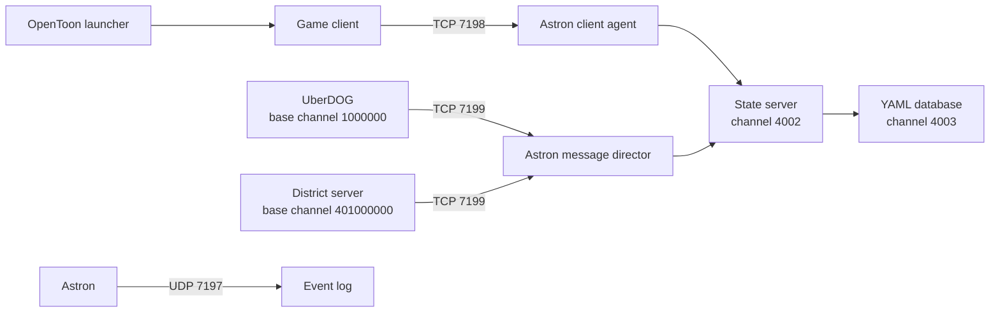

# OpenToon - Under re-Construction :)

OpenToon is a free community modification of
[Open Toontown](https://github.com/open-toontown/open-toontown). Allowing anyone the opportunity to host their own toontown server,
Either for small local friend servers or large scale productions like Toontown Rewritten and Corporate Clash. This is an entirely Open source
and modernized version of toontown. With updated Textures, 1080p support, 60fps, fishing implemented and so much more. 
It contains a local client, an Astron-backed server, a Windows server-control GUI,
cross-platform launch scripts, launcher build scripts, gameplay changes, and
verification tools. 

This was created by me and all who would like to contribute, to work towards a modernized version of toontown
for everyone to run their own private servers with minimal setup and low entry cost.

If contributing please read the TO-DO-List or if you think of any features make a pull request. 
more can be seem in the Meaningfull Commits section. 

This is a **source-only repository**. It intentionally does not distribute
game resources, native Astron executables, a Python/Panda3D runtime, live
player databases, logs, backups, or compiled launcher binaries.

The included setup scripts will automatically fetch the compatible, separately
licensed resource snapshot into the ignored local `game/resources/` folder for you so do not worry!
Users do not need to locate or copy that resource tree manually!!!

Setup also builds `game/open_town_assets/`, a local generated overlay containing
Open Town's neutral signs, street maps, display DNA, and model substitutions.
Panda3D loads that overlay before the upstream snapshot. The overlay is
reproducible from tracked source and is rebuilt automatically if it is missing,
so the presentation changes work the same way on Windows, macOS, and Linux.

## Quick Links
- [Windows quick start](#windows-quick-start)
- [macOS setup](#macos-setup)
- [Linux setup](#linux-setup)
- [Toontown Dev Discord](https://discord.gg/fmEFCU93wH) — a project-neutral community for anyone interested in developing with Toontown, across all projects and experience levels.


## Project status

| Area | Status |
| --- | --- |
| Windows client and local server | Implemented and locally exercised |
| Windows server GUI | Implemented |
| Windows launcher build | Implemented with PyInstaller |
| macOS and Linux scripts | Implemented; require target-native dependencies |
| Game resources | Not distributed |
| Production hosting/security | Not configured; defaults are for local development |

The Windows workflow is currently the best-tested path. macOS and Linux users
must supply native builds of the custom Panda3D runtime and Astron.

## What is included

- Client, UberDOG, and district-server Python source
- Astron configuration and distributed-class schemas
- A Windows GUI with Start, Stop, Restart, combined logs, process state, and
  player join/leave activity
- Windows, macOS, and Linux service launch scripts
- A small cross-platform launcher and PyInstaller build scripts
- Gameplay and quality-of-life changes documented under [`changes/`](changes/)
- A cross-platform generator for the neutral presentation overlay
- Automated checks for keyboard shortcuts, quest overlay behavior, minigame
  skipping, fishing, Gag XP, and model references
- Architecture, build, feature, and verification documentation

## How the system fits together



Services start in this order:

1. Astron
2. UberDOG
3. District server
4. Client

They should be stopped in the reverse order. In historical source names,
`AI` means the authoritative district game-server process.

## Prerequisites

All platforms need:

1. Git.
2. Python 3.9 with the Open Toontown Panda3D modules:
   `panda3d.core`, `panda3d.otp`, and `panda3d.toontown`.
3. `pytz` installed in that Python environment.
4. A target-native Astron executable.
5. A compatible `game/resources/` tree. The included setup script downloads
   the pinned upstream snapshot as a separate third-party dependency.

Stock Panda3D does not contain the required `panda3d.otp` and
`panda3d.toontown` modules. The upstream implementation is maintained in the
[Open Toontown Panda3D fork](https://github.com/open-toontown/panda3d).

## Windows quick start

### 1. Clone the source

```powershell
git clone https://github.com/NcollegeB/OpenToon.git
Set-Location .\OpenToon
```

### 2. Add a compatible runtime

First run the guided setup:

```powershell
& '.\Setup OpenToon.bat'
```

It automatically downloads the compatible resource snapshot, detects an
existing game runtime, detects Astron, and tells you exactly which native
dependency is still missing. Existing resource trees are never overwritten.

You can provide both native dependencies in one command:

```powershell
& '.\Setup OpenToon.ps1' `
  -PythonExecutable 'C:\Path\To\ppython.exe' `
  -AstronExecutable 'C:\Path\To\astrond.exe'
```

The setup script copies Astron into its expected local folder and writes the
machine-specific Python path to the ignored `game/PPYTHON_PATH` file.

To configure Python manually, copy the example and edit its first line:

```powershell
Copy-Item .\game\PPYTHON_PATH.example .\game\PPYTHON_PATH
notepad .\game\PPYTHON_PATH
```

The file must contain the path to the compatible `ppython.exe`, for example:

```text
C:\OpenToon-Dependencies\Panda3D-1.11.0-x64\python\ppython.exe
```

Alternatively, set `PPYTHON_PATH` for the server GUI and
`OPEN_TOONTOWN_PYTHON` for the launcher.

### 3. Add Astron

Place the Windows executable here:

```text
game/astron/win32/astrond.exe
```

The server uses [`game/astron/config/astrond.yml`](game/astron/config/astrond.yml).

### 4. Add resources

`Setup OpenToon.bat` performs this step automatically. The resulting separate
checkout is placed here:

```text
game/resources/
├── phase_3/
├── phase_3.5/
├── phase_4/
├── ...
└── phase_13/
```

The setup script pins the upstream revision used while developing OpenToon.
The resource checkout remains ignored by the OpenToon Git repository and is
not covered by its MIT License.

### 5. Start the server

```powershell
& '.\1 - Open Town Server GUI.bat'
```

Use **Start All** in the GUI. Wait until Astron, UberDOG, and the district
server report that they are running. The GUI also supports per-service
controls, Restart All, combined logs, and player activity.

### 6. Start the client

```powershell
& '.\2 - Open Town Client.bat'
```

The launcher UI can also be opened with:

```powershell
& '.\Open Town Launcher.bat'
```

The local development client uses `LOGIN_TOKEN=dev` and connects to
`127.0.0.1`.

## macOS setup

Run the dependency setup once:

```bash
chmod +x setup-opentoon.sh
./setup-opentoon.sh
```

This downloads the pinned separate resource tree and checks for target-native
Python and Astron.

Provide a compatible target-native Python and Astron binary:

```text
game/astron/darwin/astrond
```

Then run:

```bash
export OPEN_TOONTOWN_PYTHON=/absolute/path/to/python3.9
chmod +x game/darwin/*.sh "Open Town Launcher.command"

./game/darwin/start-astron-server.sh
./game/darwin/start-uberdog-server.sh
./game/darwin/start-ai-server.sh
./Open\ Town\ Launcher.command
```

Run each server command in its own terminal and wait for each service before
starting the next one.

## Linux setup

Run the dependency setup once:

```bash
chmod +x setup-opentoon.sh
./setup-opentoon.sh
```

This downloads the pinned separate resource tree and checks for target-native
Python and Astron.

Provide a compatible target-native Python and Astron binary:

```text
game/astron/linux/astrond
```

Then run:

```bash
export OPEN_TOONTOWN_PYTHON=/absolute/path/to/python3.9
chmod +x game/linux/*.sh open-town-launcher.sh

./game/linux/start-astron-server.sh
./game/linux/start-uberdog-server.sh
./game/linux/start-ai-server.sh
./open-town-launcher.sh
```

## Manual server commands

If you do not use the server GUI, run the platform scripts in separate
terminals.

| Service | Windows | macOS | Linux |
| --- | --- | --- | --- |
| Astron | `game/win32/start_astron_server.bat` | `game/darwin/start-astron-server.sh` | `game/linux/start-astron-server.sh` |
| UberDOG | `game/win32/start_uberdog_server.bat` | `game/darwin/start-uberdog-server.sh` | `game/linux/start-uberdog-server.sh` |
| District | `game/win32/start_ai_server.bat` | `game/darwin/start-ai-server.sh` | `game/linux/start-ai-server.sh` |
| Client | `game/win32/start_game.bat` | `game/darwin/start-game.sh` | `game/linux/start-game.sh` |

The Python entry points behind those scripts are:

```text
Astron       native astrond executable
UberDOG      python -m toontown.uberdog.UDStart
District     python -m toontown.ai.AIStart
Client       python -m toontown.launcher.QuickStartLauncher
Server GUI   python game/tools/server_gui.py
```

## Repository layout

```text
OpenToon/
├── README.md                       Public setup and code map
├── LICENSE                         MIT license for OpenToon-owned work
├── THIRD_PARTY_NOTICES.md          Upstream and dependency notices
├── Setup OpenToon.bat              Guided Windows setup wrapper
├── Setup OpenToon.ps1              Windows dependency setup
├── Setup OpenToon.command          Double-clickable macOS setup wrapper
├── setup-opentoon.sh               macOS/Linux dependency setup
├── ARCHITECTURE_LAYOUT.md          Detailed subsystem map
├── BUILDING.md                     Launcher packaging notes
├── CUSTOM_FEATURES.md              Implemented feature reference
├── VERIFICATION.md                 Test evidence and known limits
├── changes/                        Change log, audit, and prioritized TODO
├── launcher/
│   ├── src/
│   │   └── open_toontown_launcher.py
│   ├── build_windows.ps1
│   ├── build_macos.sh
│   ├── build_linux.sh
│   └── requirements-build.txt
└── game/
    ├── LICENSE                     Open Toontown BSD 3-Clause license
    ├── PPYTHON_PATH.example        Windows runtime-path template
    ├── astron/
    │   ├── config/astrond.yml      Astron roles, ports, DB, and DC files
    │   ├── databases/              Generated local state; ignored
    │   └── logs/                   Generated event logs; ignored
    ├── config/
    │   └── spellbook.json          Privileged command configuration
    ├── etc/
    │   ├── Configrc.prc            Panda3D and gameplay configuration
    │   ├── otp.dc                  Shared distributed-class schema
    │   └── toon.dc                 Game distributed-class schema
    ├── otp/                        Shared platform and networking code
    ├── toontown/                   Game-specific client/server source
    ├── tools/                      Server GUI and verification scripts
    ├── win32/                      Windows start scripts
    ├── darwin/                     macOS start scripts
    └── linux/                      Linux start scripts
```

Generated and third-party directories are shown for orientation even though
their contents are intentionally not committed.

## Where to change what

| Goal | Primary location |
| --- | --- |
| Window, graphics, FPS, audio, and input defaults | `game/etc/Configrc.prc`, `game/otp/settings/`, `game/toontown/toonbase/` |
| Login and account creation | `game/otp/login/`, `game/toontown/login/` |
| Playable character state and appearance | `game/toontown/toon/` |
| Character creation and selection | `game/toontown/makeatoon/`, `game/toontown/login/` |
| Battles, Gags, rewards, and XP | `game/toontown/battle/`, `game/toontown/toon/`, `game/toontown/building/` |
| Quests and quest UI | `game/toontown/quest/`, `game/toontown/shtiker/` |
| Fishing | `game/toontown/fishing/` |
| Minigames and skip behavior | `game/toontown/minigame/`, `game/toontown/trolley/` |
| Buildings and interiors | `game/toontown/building/` |
| Enemy behavior and facilities | `game/toontown/suit/`, `game/toontown/coghq/`, `game/toontown/cogdominium/` |
| Neighborhoods and zone startup | `game/toontown/hood/`, `game/toontown/town/`, `game/toontown/safezone/` |
| Estates, pets, racing, golf, and parties | Corresponding folders under `game/toontown/` |
| Global server services | `game/toontown/uberdog/`, `game/otp/uberdog/` |
| District boot and server repositories | `game/toontown/ai/`, `game/otp/ai/` |
| Networked object fields | `game/etc/otp.dc`, `game/etc/toon.dc` |
| Astron ports and database backend | `game/astron/config/astrond.yml` |
| Privileged developer commands | `game/config/spellbook.json`, `game/toontown/spellbook/` |
| Server-control GUI | `game/tools/server_gui.py` |
| Desktop launcher | `launcher/src/open_toontown_launcher.py` |

## Client/server code pattern

Networked gameplay systems commonly use three cooperating files:

```text
DistributedExample.py      Client-side object, presentation, and requests
DistributedExampleAI.py    District-side authoritative rules and state
DistributedExampleUD.py    Optional global UberDOG service
```

Their network-visible fields and methods must also be declared in
`game/etc/otp.dc` or `game/etc/toon.dc`. When changing a distributed field,
update the schema and both endpoints together. A client-only rule is not
authoritative and should not be trusted for rewards, inventory, access, or
persistent state.

## Where player characters are stored

There are two separate meanings of “character storage.”

### Character implementation

Playable-character code lives primarily in:

```text
game/toontown/toon/
├── ToonDNA.py               Appearance/DNA representation
├── DistributedToon.py       Client-side networked avatar
├── DistributedToonAI.py     District-side avatar authority
├── LocalToon.py             Local player's client behavior
├── InventoryBase.py         Shared Gag inventory representation
├── InventoryNew.py          Current Gag inventory rules and UI
└── Experience.py            Gag experience state
```

Character creation and chooser screens live in `game/toontown/makeatoon/` and
`game/toontown/login/`.

### Saved player records

The development login database is created at runtime:

```text
game/astron/databases/
├── accounts.json            Login-token to account-object mapping
└── astrondb/
    ├── info.yaml             Next database object ID
    └── <do-id>.yaml          Account and avatar objects
```

`game/otp/login/AstronLoginManagerUD.py` implements the local developer
account flow. An account object contains its avatar slots; each avatar is a
separate Astron database object. These files contain live player data and are
ignored by Git.

Stop all services and back up the database before inspecting or migrating it.
Do not hand-edit object YAML while Astron is running.

## Important file types

| Type | Purpose | Typical location |
| --- | --- | --- |
| `.py` | Client, district, UberDOG, GUI, launcher, and test logic | `game/otp/`, `game/toontown/`, `game/tools/`, `launcher/src/` |
| `.dc` | Distributed-class network schema | `game/etc/` |
| `.prc` | Panda3D and game configuration | `game/etc/` |
| `.yml` | Astron service configuration | `game/astron/config/` |
| `.yaml` | Generated Astron database objects | `game/astron/databases/astrondb/` |
| `.json` | Source configuration or generated runtime mappings | `game/config/`, ignored runtime directories |
| `.dna` | World, street, and interior layout data | local `game/resources/` |
| `.bam` | Compiled Panda3D models | local `game/resources/` |
| `.egg` | Panda3D model source/interchange files | local resource workspaces |
| `.png`, `.jpg` | Textures and interface artwork | local `game/resources/` |
| `.ogg`, `.wav` | Music, dialog, and sound effects | local `game/resources/` |
| `.bat` | Windows launch helpers | repository root, `game/win32/` |
| `.ps1` | Windows launcher build automation | `launcher/` |
| `.sh`, `.command` | Linux/macOS launch and build helpers | repository root, `game/{linux,darwin}/`, `launcher/` |
| `.md` | Documentation and change records | repository root, `changes/`, `game/tools/` |

## Server ports and channels

The checked-in Astron configuration binds only to loopback:

| Endpoint | Default |
| --- | --- |
| Astron event logger | UDP `127.0.0.1:7197` |
| Astron client agent | TCP `127.0.0.1:7198` |
| Astron message director | TCP `127.0.0.1:7199` |
| State server control channel | `4002` |
| Database control channel | `4003` |
| UberDOG base channel | `1000000` |
| District base channel | `401000000` |

If you change a port, update every launcher or service command that references
it. Do not expose the development configuration directly to the internet.

## Building the launcher

The launcher is a small Tk desktop application. Its packaged executable still
expects the `game/` source, resources, and compatible runtime beside the
launcher bundle; it does not embed the game.

### Windows

```powershell
powershell -ExecutionPolicy Bypass -File .\launcher\build_windows.ps1 `
  -PythonExecutable 'C:\Path\To\python.exe'
```

Or set `OPEN_TOONTOWN_BUILD_PYTHON` and run:

```powershell
& '.\Build Windows Launcher.bat'
```

Output:

```text
launcher/dist/windows/OpenTownLauncher.exe
```

### macOS

```bash
OPEN_TOONTOWN_BUILD_PYTHON=/path/to/python3 \
  ./launcher/build_macos.sh
```

### Linux

```bash
OPEN_TOONTOWN_BUILD_PYTHON=/path/to/python3 \
  ./launcher/build_linux.sh
```

PyInstaller must be run on the target operating system. A Windows build cannot
produce a native macOS application, and a macOS build cannot produce a native
Windows executable.

## Meaningful commits and contributions

Keep each commit focused on one logical change and small enough for another
contributor to review. A commit should leave the repository in a working state
whenever practical. Before submitting a change:

- Read and understand every line you add or modify.
- Use a clear, imperative commit subject that describes the result, such as
  `Fix fishing target ownership checks`, rather than `updates` or `misc fixes`.
- Explain what changed, why it was needed, and how it was verified in the pull
  request.
- Include relevant tests and documentation with the behavior they cover.
- Separate unrelated features, formatting, generated files, and refactors into
  different commits.
- Do not commit secrets, logs, caches, local databases, or build outputs unless
  the repository intentionally tracks that specific artifact.
- Preserve copyright, license, and attribution notices.

### AI- and LLM-assisted contributions

AI or LLM tools may assist with a contribution, but they do not replace
contributor judgment or review. Prefer minimal generated code. The contributor
submitting the change remains responsible for its correctness, security,
licensing, maintainability, and compatibility with the rest of the project.

Before submitting AI- or LLM-assisted code:

- Read, understand, and manually review every generated or modified line.
- Verify APIs, dependencies, file paths, assumptions, and error handling against
  the actual repository.
- Remove unnecessary abstractions, duplicated code, fabricated behavior, and
  unused dependencies.
- Run the relevant automated checks and perform an end-to-end test when the
  change affects gameplay, networking, persistence, packaging, or security.
- Mention substantial AI or LLM assistance in the pull-request description so
  reviewers know where additional scrutiny may be useful.

Unreviewed generated output is not an acceptable contribution.

### Resource and artwork contributions

Only contribute artwork, models, textures, audio, fonts, or other resources
that meet at least one of these conditions:

- You created the resource and have the right to license it to the project.
- It is verifiably in the public domain or released under CC0.
- Its explicit license permits modification and open-source redistribution in
  this project.
- You have written permission from the rights holder to contribute it under the
  project's chosen asset license.

Include the creator, original source, exact license, required attribution, and
editable source file when available. A resource described only as
`license-free`, `royalty-free`, or `found online` is not sufficient; the actual
license terms must permit this project's use and redistribution. Do not submit
extracted proprietary assets, close traces, recolors, or lightly modified
versions of material that the contributor does not have permission to
redistribute. The absence of a license is not permission.

## Verification

Run these from `game/` using the compatible game Python:

```powershell
& $env:OPEN_TOONTOWN_PYTHON -u tools/test_keyboard_shortcuts.py
& $env:OPEN_TOONTOWN_PYTHON -u tools/verify_quest_overlay.py
& $env:OPEN_TOONTOWN_PYTHON -u tools/test_minigame_skip.py
& $env:OPEN_TOONTOWN_PYTHON -u tools/test_diving_twod_cleanup.py
& $env:OPEN_TOONTOWN_PYTHON -u tools/test_race_cleanup.py
& $env:OPEN_TOONTOWN_PYTHON -u tools/test_target_photo_cleanup.py
& $env:OPEN_TOONTOWN_PYTHON -u tools/test_live_minigame_harness.py
& $env:OPEN_TOONTOWN_PYTHON -u tools/test_fishing_server.py
& $env:OPEN_TOONTOWN_PYTHON -u tools/test_fishing_persistence.py
& $env:OPEN_TOONTOWN_PYTHON -u tools/verify_gag_xp.py
& $env:OPEN_TOONTOWN_PYTHON -u tools/verify_gagshop_models.py
```

With the local server running, start the verified two-client Maze workflow:

```powershell
& .\tools\start_live_minigame_clients.ps1
```

The development launcher accepts one through four distinct local account
tokens, gives every client a separate log, tiles the windows, and requests the
selected minigame from the first client. Each account must already have a
playable avatar in slot zero. For example:

```powershell
& .\tools\start_live_minigame_clients.ps1 `
  -Tokens dev,dev2,dev3,dev4 `
  -Minigame maze
```

See [`VERIFICATION.md`](VERIFICATION.md) for the current evidence and known
limits. Passing source-level checks does not replace an end-to-end client test.

## Development-server warning

The default setup is deliberately convenient for localhost development:

- It binds Astron services to `127.0.0.1`.
- It uses a simple `LOGIN_TOKEN`.
- A newly generated developer account may receive elevated access.
- It stores objects in readable YAML files.

Before hosting publicly, implement real authentication, least-privilege access,
backups, TLS or a trusted network boundary, secrets management, monitoring,
rate limiting, and a tested update/recovery process.

## Documentation

- [`ARCHITECTURE_LAYOUT.md`](ARCHITECTURE_LAYOUT.md): detailed source and
  service map
- [`CUSTOM_FEATURES.md`](CUSTOM_FEATURES.md): gameplay and quality-of-life
  changes
- [`BUILDING.md`](BUILDING.md): launcher packaging details
- [`VERIFICATION.md`](VERIFICATION.md): test results and remaining validation
- [`changes/README.md`](changes/README.md): change-log index
- [`changes/TODO.md`](changes/TODO.md): prioritized work queue

## Credits and licenses

OpenToon is modified and maintained by **NcollegeB** and is based on
**Open Toontown**.

- Original OpenToon additions and modifications: [MIT License](LICENSE)
- Open Toontown-derived source under `game/`: [BSD 3-Clause](game/LICENSE)
- Other retained source notices: [third-party notices](THIRD_PARTY_NOTICES.md)
- Game resources and native runtime components: not distributed and not
  covered by the root MIT License

The root MIT License applies only to material that NcollegeB has the right to
license. Existing third-party copyrights and licenses remain in effect.
